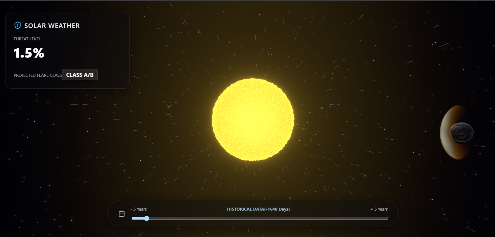

# Solar Flare Prediction System & 3D WebGL Visualization

A powerful two-part project combining deep historical Machine Learning (Random Forest) for 5-year solar flare forecasting, coupled with a cinematic, highly-interactive 3D WebGL visualization built with React Three Fiber.

## Overview

This project aims to predict the occurrence and threat level of Solar Flares over a long-term **5-Year Forecasting Horizon**. It achieves this by scaling a Random Forest model to analyze 110+ years of historical Sunspot Cycle Data, automatically extracting 11-year cyclical lag features.

The resulting AI predictions are then fed into a stunning, native GPU-shader 3D web application. The interface provides a 10-year interactive timeline scrubber (5 years of past data, 5 years of future predictions) where you can physically watch Coronal Mass Ejections (CMEs), Solar Winds, and Earth's Magnetosphere (Bow Shock) react mathematically to the AI's threat level in real-time.

## Features

- **Machine Learning Engine (Colab/Python)**
  - Automatically fetches the official SILSO (Sunspot Index and Long-term Solar Observations) dataset.
  - Dynamically generates deep historical "Lag Features" based on 11-year Solar Cycles, giving the model over a century of context without memory bloat.
  - Trains a Random Forest Regressor to predict solar threat levels 5 years into the future.
  - Exports a `prediction_5yr.json` containing a seamless 10-year timeline (-5 years historical, +5 years predicted).

- **Cinematic 3D Interface (React + Three.js)**
  - **Custom WebGL Physics Shaders:** The Solar Wind isn't simple animation; it's a volumetric particle system of 8,000 strings driven by Simplex Noise and fluid dynamics natively on your GPU.
  - **Dynamic Threat Reactions:** As you scrub the timeline towards an 'X-Class' flare prediction, the solar wind dynamically speeds up by 15x, burns deep red, and the emission density thickens.
  - **Earth's Magnetosphere (Bow Shock):** Features a fiery, mathematically perfect crescent shield that protects Earth. The solar wind particles use fluid-dynamic vector math to perfectly slide around the shield structure.
  - **Photorealistic Earth:** Uses 4K NASA textures for Albedo, Normal, and Specular mapping, along with an independent, dynamically rotating cloud layer.
  - **Minimal Glassmorphic HUD:** A clean, immersive UI that keeps the focus on the 3D data visualization.

## Technologies Used

### Machine Learning (Python)
*   **Pandas & NumPy:** Data cleaning, interpolation, and feature engineering.
*   **Scikit-Learn:** `RandomForestRegressor` for forecasting.
*   **Matplotlib:** For timeline visualization in the notebook.

### 3D Web Interface (JavaScript/React)
*   **React + Vite:** Ultra-fast frontend tooling and component architecture.
*   **Three.js:** The core 3D WebGL rendering engine.
*   **React Three Fiber (`@react-three/fiber`):** A React renderer for Three.js.
*   **Drei (`@react-three/drei`):** Useful helpers for R3F (OrbitControls, Stars, texturing).
*   **GLSL (OpenGL Shading Language):** Custom Vertex and Fragment shaders for the Sun surface, Solar Wind physics, and Earth's Bow Shock.
*   **Lucide React:** Minimalist iconography for the UI.

---

## Installation & Setup

### Part 1: Generating the AI Data (Optional)
If you want to train the model yourself or adjust the 5-year prediction horizon:
1. Open the provided `Colab_Model_Training.md` (or copy the Python script inside it).
2. Paste the script into a [Google Colab](https://colab.research.google.com/) notebook and Run it.
3. The script will automatically download historical CSVs, train the model, plot the results, and generate a `prediction_5yr.json` file.
4. Download the `prediction_5yr.json` file and place it in the `public/` directory of the web app. *(Note: A default prediction file is already included in the repo!)*

### Part 2: Running the 3D Web App
1. **Prerequisites:** Ensure you have [Node.js](https://nodejs.org/) installed.
2. Clone this repository to your local machine.
3. Navigate into the visualizer directory:
   \`\`\`bash
   cd solar-flare-prediction
   \`\`\`
4. Install the dependencies:
   \`\`\`bash
   npm install
   \`\`\`
5. Start the Vite development server:
   \`\`\`bash
   npm run dev
   \`\`\`
6. Open your browser to the local address provided (usually `http://localhost:5173/`).

## How to Use the Visualizer
*   **Orbit Camera:** Left-Click and drag anywhere on the screen to rotate around the Sun.
*   **Pan Camera:** Right-Click and drag to pan across the solar system and view Earth.
*   **Zoom:** Use the scroll wheel to zoom in and out.
*   **Timeline Scrubber:** Use the slider at the bottom to travel through time. 
    *   **Blue Zone:** Historical data (the past 5 years).
    *   **Orange Zone:** AI Predictions (the next 5 years).
* Watch how the Solar Wind and Earth's Bow Shock mathematically react to the `Threat Level %` on the exact day you have selected!

## License
MIT License. Free to use, modify, and distribute for educational and commercial purposes.
